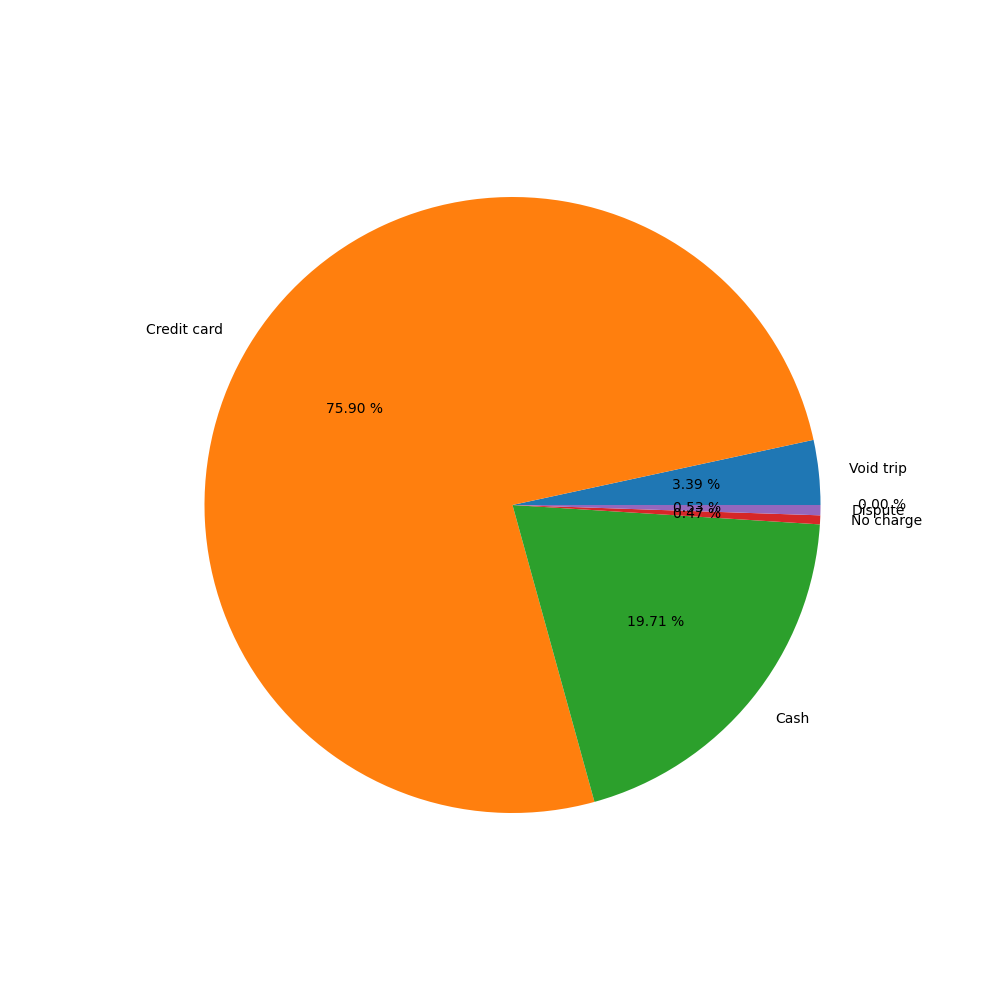
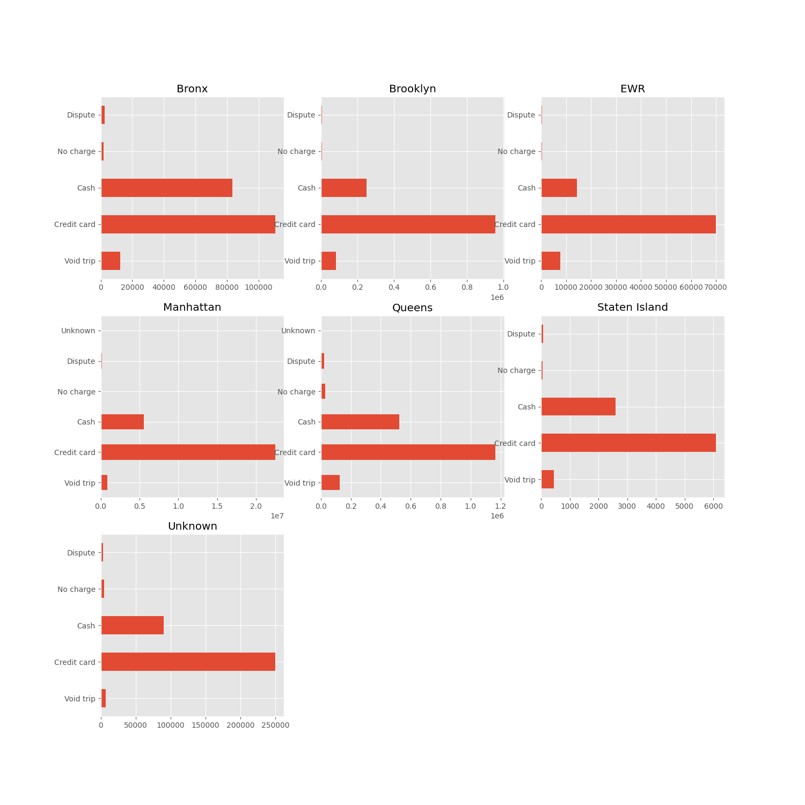
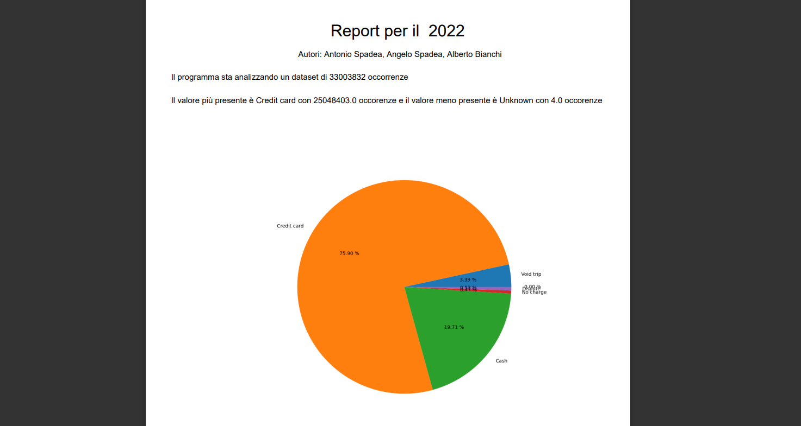
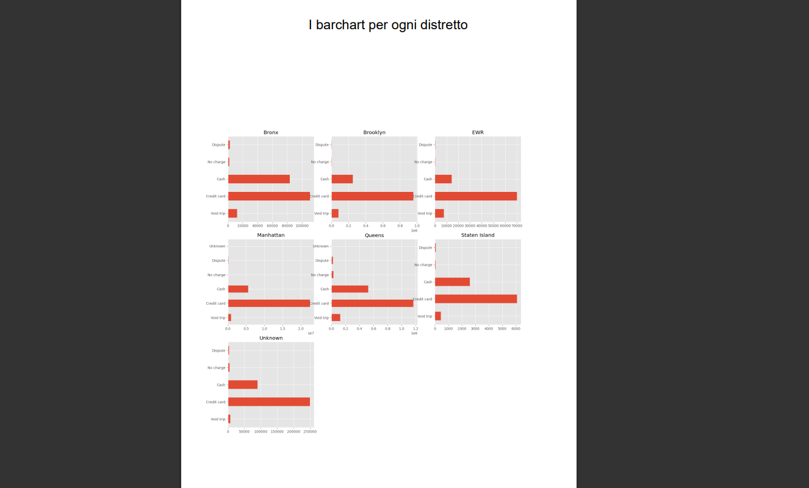

# ProgettoGuarrasi
## Come si muovono i taxi a New York?

In questo progetto svolgiamo un'analisi dei taxi a New York. In particolare, siamo curiosi di rispondere ad alcune specifiche Research Questions (RQ) che possono aiutare i tassisti a pianificare i loro spostamenti in città e i clienti a fornire suggerimenti sulla convenienza dell’utilizzo di questo servizio.
Per questo progetto utilizziamo i dati pubblici delle rotte dei Taxi a NYC disponibili su https://www1.nyc.gov/site/tlc/about/tlc-trip-record-data.page. 
Di default il programma utilizzerà dei dati relativi ai Yellow Taxi per l'anno 2022.

## Research Questions (RQ)

Qual è la modalità di pagamento più comune? E quella meno comune? Scoprite il modo in cui vengono eseguiti i pagamenti in ogni distretto e visualizzate il numero di pagamenti per ogni possibile mezzo. 

## Prima di cominciare

Per preparare il programma al suo corretto utilizzo strutturare la directory, con i dati scaricabili dal link sopra, come segue

[Primo link][link1] Vanno scaricati tutti i file relativi ai "yellow trip data" con estensione  .parquet che andranno inseriti nella cartella ./dati/anni e nel corretto anno. 
**Esempio** quelli del 2022 andranno inseriti nella directory ./dati/anni/2022

[Secondo link][link1] Dal seguente link dovrete scaricare il file "taxi+_zone_lookup.csv" che andrà inserito nella directory ./dati/tabelle_di_conversione

## Tipica struttura della directory del programma

    .
    ├── dati
    │   ├── anni
    │   │   ├── 2022
    │   │   │   ├── yellow_tripdata_2022-01.parquet    #scaricare i file dal link sopra
    │   │   │   ├── yellow_tripdata_2022-02.parquet    #mantenendo la struttura del nome,
    │   │   │   └── ...                                #in caso fosse aggiunto ..(1).parquet 
    │   │   │                                          #"(1)"deve essere eliminato
    │   │   ├── 2021
    │   │   │   └── ...
    │   │   └── 2020
    │   │       └── ...
    │   └── tabelle_di_conversione
    │       └── taxi+_zone_lookup.csv
    ├── output
    ├── .gitignore
    ├── requirements.txt
    ├── main.py
    ├── ... *.py 
    ├── ... *.py 
    └── README.md

## Avvio programma

Il programma viene avviato da riga di comando eseguendo il seguente comando e inserendo un anno come parametro obbligatorio 
```sh
python main.py 2022
```
Per avviare il programma con i parametri opzionali basta inserire dopo l'anno -m seguito dal mese relativo e/o -d seguito dal distretto 
```sh
python main.py 2022 -m 04 -d Bronx
```
## Input e Output

Il programma accetta da riga di comando i seguenti input e restituisce dei grafici da terminale, ogni risultato viene poi salvato nella cartella ./output insieme ad un **PDF** riepilogativo

| Input |Input opzionali | Output |
| ------ | ------ | ------ |
| anno| mese, borough(quartiere) | file, grafico |

**NOTA**
Per l'anno 2022 saranno disponibili solo i primi 10 mesi 
L'elenco dei quartieri è il seguente :
- Bronx
- Brooklyn
- EWR
- Manhattan
- Queens
- Staten Island
- Unknown

Per maggiori informazioni consultare help da riga di comando

```sh
python main.py -h
```

**Esempio Output**

Terminato il caricamento dati e l'elaborazione di essi, il terminale stamperà a video i risultati della ricerca mostrando il metodo più e meno utilizzati. 

Nel primo grafico saranno restituiti i risultati che mostreranno anche le percentuali di tutti gli altri metodi di pagamento, mettendoli così a confronto.



Nel secondo grafico verrà mostrato in dettaglio per ogni quartiere il risultato di ogni tipo di pagamento



Nel **PDF** verrà mostrato un report riepilogativo che ha come titolo i parametri di ricerca utilizzati per l'annalisi, verrà mostrato il numero delle occorenze su cui è stata fatta l'analisi e i conseguenti risultati. Seguiranno i grafici stampati da terminale




## Conclusione
Verrà così illustrata la modalità di pagamento più comune e quella meno comune.Per ogni **Quartiere** verrà elencato l'utilizzo di ogni metodo di pagamento. Il risultato verrà stampato da riga di comando, seguiranno due grafici che illustreranno in dettaglio il risultato oppure tutti i risultati saranno poi consultabili da **Risultati.pdf** nella cartella **output**
 

   [link1]: https://www.nyc.gov/site/tlc/about/tlc-trip-record-data.page
   [link2]: https://d37ci6vzurychx.cloudfront.net/misc/taxi+_zone_lookup.csv
